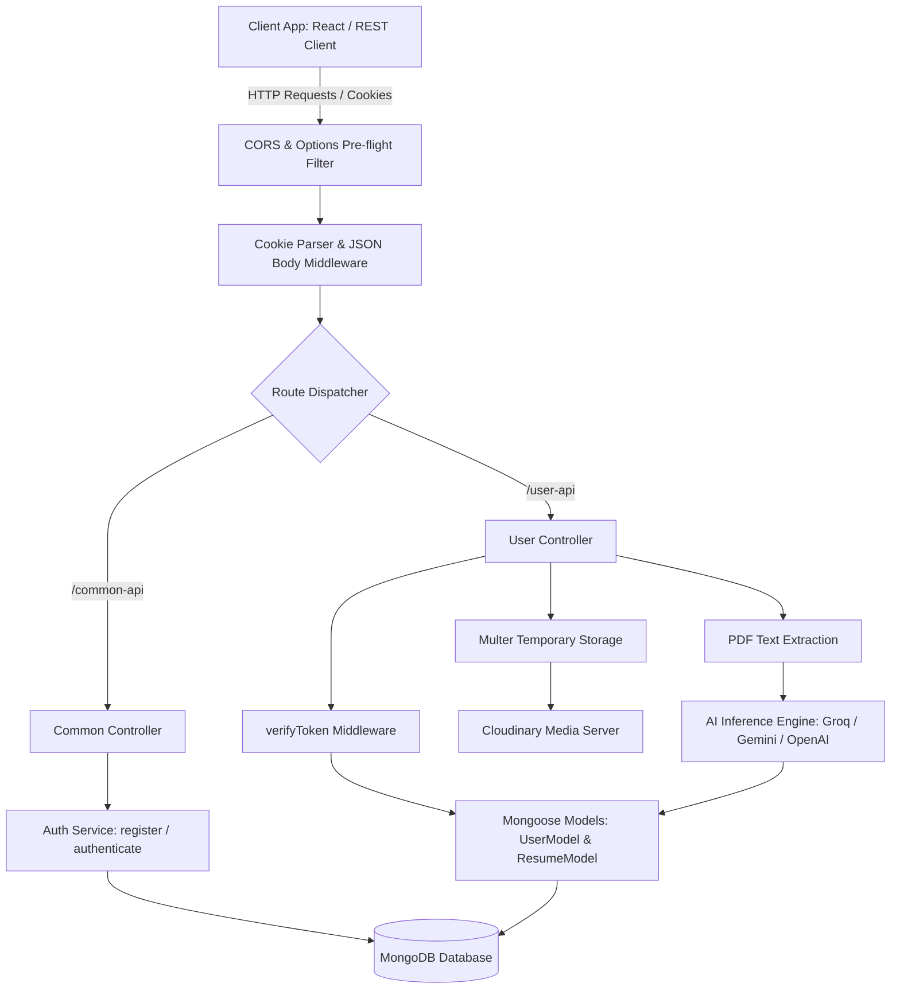

# ResAI Backend — Enterprise RESTful API

A robust, enterprise-grade, secure RESTful API built on the MERN stack for the **AI-Powered Resume Analyzer**. This API supports secure authentication, intelligent PDF parsing, AI-driven resume scoring using state-of-the-art LLMs (Groq, Gemini, OpenAI), and secure media uploads via Cloudinary.

 **Live Production API Base URL:** [resai-backend-gepb.onrender.com](https://resai-backend-gepb.onrender.com)

---

##  Tech Stack & Key Integrations

*   **Core Server Framework:** Node.js & Express (v5.2.x for modern routing capabilities)
*   **Database & Object Modeling:** MongoDB & Mongoose (Schema validation, populated relations, and strict entity structuring)
*   **Security & Encryption:** JWT (JSON Web Tokens) via `httpOnly` cookies, bcryptjs (password hashing)
*   **Media Storage Pipeline:** Cloudinary API integrated with Multer for secure file hand-offs
*   **AI & Document Parsing:** `pdf-parse` & `pdfjs-dist` for raw text extraction, combined with multi-provider SDK integrations (`groq-sdk`, `@google/genai`, `openai`) for semantic ATS analysis
*   **Config Management:** Dotenv for secure local and staging environment variables
*   **API Testing Framework:** Integrated Rest Client HTTP test suite (`req.http`)

---

##  Architecture & Flow Diagram

The following architecture diagram represents the request-response lifecycle from the client app down to the database, cloud storage, and AI inference engines:



---

##  Project Directory Structure

Here is a high-level mapping of the project's codebase:

```text
BACKEND/
├── APIs/                  # REST Controllers & Routes
│   ├── CommonAPI.js       # Common endpoints (login, logout, token check)
│   └── UserAPI.js         # User endpoints (registration, resume upload, analysis history)
├── config/                # Service Integrations & Configurations
│   ├── cloudinary.js      # Cloudinary SDK wrapper initialization
│   ├── db.js              # Mongoose database connector
│   ├── gemini.js          # Google Gemini AI configuration
│   └── openai.js          # OpenAI SDK configuration
├── middlewares/           # Global Express interceptors
│   ├── verifyToken.js     # JWT token decoder (extracts from secure HTTP-only cookies)
│   └── multer.js          # File filter validation & temporary storage controls
├── models/                # Mongoose Database Schemas
│   ├── ResumeSchema.js    # Schema for uploaded resumes and AI ATS insights
│   └── UserSchema.js      # User Schema for authentication and profile data
├── services/              # Business Logic & Document Processing
│   ├── analyzeResume.js   # Interacts with AI to score and critique resumes
│   └── extractPdfText.js  # Wrapper around pdf-parse to extract clean strings
├── uploads/               # Temporary local folder generated by Multer
├── .env                   # Local server configuration variables (ignored in Git)
├── .gitignore             # Git untracked files specification
├── package.json           # Application dependencies & starting scripts
├── req.http               # Pre-defined HTTP REST Client test suite
└── server.js              # Application entry point, DB connector, & error middlewares
```

---

##  Environment Configuration

To run this backend locally, create a `.env` file in the root folder of the `BACKEND` directory with the following keys. Note that in cloud platforms like **Render**, the application port is dynamically assigned at runtime; however, a default local port needs to be specified:

```ini
# Application Running Port (Defaults to 4000 locally; overridden dynamically in Render)
PORT=4000

# Database Connection string (MongoDB Atlas or Local MongoDB)
MONGO_URI=your_mongodb_connection_string

# Frontend Connection configuration
FRONTEND_URL=http://localhost:5173

# Encryption secrets
JWT_SECRET_KEY=your_jwt_signature_secret_key

# External AI Integrations
GROQ_API_KEY=your_groq_api_key

# Cloudinary Integration API credentials
CLOUDINARY_CLOUD_NAME=your_cloudinary_cloud_name
CLOUDINARY_API_KEY=your_cloudinary_api_key
CLOUDINARY_API_SECRET=your_cloudinary_api_secret
```

---

##  Database Schemas & Data Models

### 1. User Model (`users`)
Responsible for authentication and profile management. Saved under `models/UserSchema.js`.

| Field | Type | Attributes | Description |
| :--- | :--- | :--- | :--- |
| `name` | String | Required | Full name of the user |
| `email` | String | Required, Unique | Email address used for authentication |
| `password` | String | Required | Encrypted password (hashed with bcryptjs) |
| `profilePicture` | String | Default: `""` | Optional URL hosting the user's avatar |
| `createdAt` | Timestamp | Auto-generated | Timestamp of account creation |

### 2. Resume Model (`resumes`)
Responsible for tracking Cloudinary assets, the owning user, and the AI ATS analysis. Saved under `models/ResumeSchema.js`.

| Field | Type | Attributes | Description |
| :--- | :--- | :--- | :--- |
| `userId` | ObjectId | Required, Ref `user` | Foreign key referencing the author profile |
| `resumeName` | String | Required | Filename or customized title |
| `targetRole` | String | Required | Intended job title for AI context |
| `fileUrl` | String | Required | Cloudinary URL for the uploaded PDF |
| `filePublicId`| String | Required | Cloudinary Asset ID |
| `atsScore` | Number | Default: `0` | AI-evaluated compatibility score (0-100) |
| `scoringBreakdown`| Object | Structure | Detailed section-by-section scoring breakdown |
| `missingSkills`| Array | String Array | Detected gaps based on target role |
| `aiSuggestions`| Array | String Array | Actionable improvements from the AI |
| `status` | String | Enum | `uploading`, `processing`, `completed`, `failed` |

---

##  API Reference Guide

###  Auth & Common Routes (`/common-api`)

| Method | Endpoint | Access | Headers | Body / Parameters | Description |
| :--- | :--- | :--- | :--- | :--- | :--- |
| **POST** | `/login` | Public | JSON | `{ email, password }` | Authenticates users and sets an `httpOnly` cookie. |
| **GET** | `/logout` | Auth | Cookie | None | Clears the authorization HTTP-Only token cookie. |
| **GET** | `/check-auth`| Auth | Cookie | None | Validates current token, returns full profile details. |

###  User & Resume Routes (`/user-api`)

| Method | Endpoint | Access | Headers | Body / Parameters | Description |
| :--- | :--- | :--- | :--- | :--- | :--- |
| **POST** | `/register` | Public | JSON | `{ name, email, password }` | Registers a new user account. |
| **POST** | `/upload-resume`| Auth | `multipart/form-data` | Form: `file` & `targetRole`| Parses PDF, runs AI inference, saves data, uploads to Cloudinary. |
| **GET** | `/user-resumes` | Auth | Cookie | None | Retrieves all analyzed resumes for the logged-in user. |
| **GET** | `/resume/:id` | Auth | Cookie | Parameter: `:id` | Fetches a specific analyzed resume by ID. |

---

##  Custom Middlewares & Security Stack

### 1. Token Verification Middleware (`verifyToken.js`)
Robust auth middleware that extracts incoming JWTs from `req.cookies`. Handles invalid or expired sessions and populates the `req.user` object securely before letting requests hit protected routes.

### 2. File Upload Validation Rules (`multer.js`)
*   **Ephemeral Storage:** Automatically creates an `uploads/` directory to prevent `ENOENT` crashes, managing temporary local storage prior to Cloudinary hand-off.
*   **Type Guarding:** Restricts uploads specifically to PDF formatting to ensure the `pdf-parse` pipeline succeeds cleanly.

### 3. Application-Level Defenses
*   **CORS Configuration:** Explicitly maps allowed clients dynamically, enabling `credentials: true` to accept HTTP-Only cookies.
*   **Global Error Interceptor:** Found in `server.js`, this wrapper catches gracefully unhandled promise rejections and normalizes Mongoose errors (like unique constraint `11000`) before they reach the client.

---

##  Getting Started & Local Setup

### Prerequisites
1.  **Node.js:** Ensure Node.js v18+ is installed.
2.  **Database:** A MongoDB instance running locally, or a MongoDB Atlas URI string.
3.  **Media Hosting:** Cloudinary credentials for hosting processed resumes.
4.  **AI Providers:** API Keys for Groq (or Gemini/OpenAI if configured).

### Installation Instructions
1.  Navigate to the `BACKEND` directory and install dependencies:
    ```bash
    npm install
    ```
2.  Configure your environment file (`.env`) matching the structure outlined in the Configuration section.
3.  Boot the application backend:
    ```bash
    npm run dev
    ```
    *The console should output the active port and confirm database connection success.*

---

##  Cloud Deployment & Hosting Mappings

This production-ready backend application is successfully deployed as a live web service on **Render**:

 **Live Production API Base URL:** `https://resai-backend-gepb.onrender.com`

### 1. Dynamic Port Allocation on Cloud Services
You **do not** need to manually configure or hardcode the `PORT` environment variable on your live hosting dashboard. The Express app listens dynamically: `process.env.PORT || 4000`.

### 2. Environment Variables Configuration
Do not commit your local `.env` file. Configure these values securely under **Environment Variables** on the Render dashboard:
- `MONGO_URI`
- `JWT_SECRET_KEY`
- `GROQ_API_KEY`
- `CLOUDINARY_CLOUD_NAME`, `CLOUDINARY_API_KEY`, `CLOUDINARY_API_SECRET`
- `FRONTEND_URL` *(Your live Vercel frontend URL)*

---

##  Testing with REST Client (`req.http`)

The workspace includes a complete suite of mock request tests inside `req.http`. 

To utilize this suite:
1.  Install the **REST Client** extension in VS Code.
2.  Open `req.http`.
3.  Click the **`Send Request`** button appearing above the respective HTTP methods.
4.  Test full endpoints including registration, login, token verification, and data retrieval dynamically!

---


