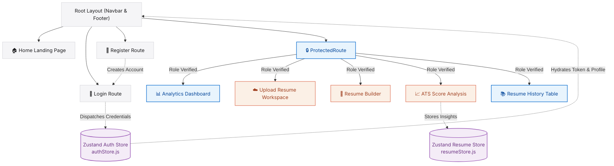

# ResAI Client — Premium React 19 Frontend

[](https://react.dev/)
[](https://vite.dev/)
[](https://tailwindcss.com/)
[](https://github.com/pmndrs/zustand)
[](https://reactrouter.com/)

🔗 **Live Production Deploy:** [resai-frontend-cyan.vercel.app](https://resai-frontend-cyan.vercel.app)

Welcome to the **ResAI Frontend Client**—a premium, enterprise-grade, high-fidelity React 19 Single Page Application (SPA) designed to power the user-facing interface of the **AI-Powered Resume Analyzer**.

Inspired by **Apple's iconic, ultra-clean web aesthetics (Apple Light Theme)**, this client application is meticulously engineered around raw typography, strict layout constraints, crisp spacing, and smooth micro-animations. It operates seamlessly, offering instant state synchronization, role-based dashboards, real-time PDF generation, and bulletproof security guards.

---

## 💎 Core Architecture Highlights

### 1. Apple Light Theme & Design System
Rather than scattered styling helpers, the visual language is governed by a **centralized design token registry**. Inspired by Apple's minimalist aesthetic:
* **Pristine Canvas:** Pure white canvas with soft `#f5f5f7` card backings and `#e8e8ed` dividers.
* **Apple Typography:** Strict text hierarchies utilizing bold, tracking-tight titles and muted secondary gray body typography (`#6e6e73`).
* **Visual Premium Details:** Elegant `backdrop-blur-xl bg-white/85` sticky navbars, thin borders, rounded-full pills, and zero heavy shadows.
* **Vibrant Focus Elements:** The iconic premium blue for primary elements, active links, and brand buttons.

### 2. State Hydration & Token Reconciliation (`src/store/authStore.js` & `src/store/resumeStore.js`)
Powered by **Zustand**, global authentication and application state management is extremely robust:
* **Session Restoration:** On application reload or initial page load, a dedicated background hook checks if a JWT token is cached. It fetches user metadata before completing the render lifecycle, preventing flashing unauthenticated contents or premature redirects.
* **Instant Logout Cleanup:** On logout, both client state and local caches are cleanly purged.
* **Global Loading State Hooks:** Exposes unified loading and error boundaries so pages can smoothly render loading animations during state transitions.

### 3. Bulletproof Access Security
Client routes are guarded at the component level:
* **Seamless Redirection:** Authenticates first; if an unauthenticated user tries to access protected endpoints, it seamlessly dispatches them to `/login` paths with browser history replacement to prevent back-button loops.

### 4. Interactive AI Workspace
* **Dynamic Upload Zone:** A premium drag-and-drop area for uploading resumes, directly connecting to AI models for deep analysis.
* **Resume Builder Interface:** In-place authoring tools with live PDF previews generated seamlessly using `@react-pdf/renderer`.
* **Deep Dynamic Insights:** Features inside the dashboard enabling users to see detailed ATS scores, missing skills, and history tables.

---

## 🗺️ Client Navigation & State Architecture

This diagram visualizes the application's page structure, route protection, and Zustand state synchronization:



---

## 📂 Project Directory Structure

```text
FRONTEND/
├── public/                 # Static assets (favicons, manifest, etc.)
├── src/
│   ├── assets/             # Brand logos, stock images, and visual graphics
│   ├── components/         # Page Views and Structural Layout Components
│   │   ├── ATSScore.jsx        # Component rendering the ATS score
│   │   ├── BackgroundDecoration.jsx # CSS Glassmorphism Animations
│   │   ├── Footer.jsx          # Apple-styled minimalist footer
│   │   ├── HistoryTable.jsx    # Table layout for past resumes
│   │   ├── Navbar.jsx          # Sticky blur-backdrop navigation bar
│   │   ├── UploadForm.jsx      # Managed form for submitting PDFs
│   │   └── ...                 # Additional granular components
│   ├── layout/             # Master structural wrappers
│   │   └── AppLayout.jsx       # Layout containing sidebars and nav
│   ├── pages/              # Primary Route Views
│   │   ├── Dashboard.jsx       # Analytics and recent history view
│   │   ├── Home.jsx            # Elegant Apple-style marketing landing page
│   │   ├── Login.jsx           # Secure login form with validation
│   │   ├── Register.jsx        # Multi-role account creator
│   │   ├── ResumeAnalysis.jsx  # Page rendering the detailed AI insights
│   │   ├── ResumeBuilder.jsx   # Interactive real-time resume editor
│   │   └── UploadResume.jsx    # Upload area for external PDFs
│   ├── services/           # External Communications
│   │   └── api.js              # Axios network logic with interceptors
│   ├── store/              # Centralized State Management
│   │   ├── authStore.js        # Zustand state (checkAuth, tokens, login & logout)
│   │   └── resumeStore.js      # Zustand state (managing builder and analysis data)
│   ├── styles/             # Application Theme styling
│   ├── App.css             # Main styling entry (root styles, fonts)
│   ├── App.jsx             # React Router v7 routes definition tree
│   ├── index.css           # Tailwind CSS directives & custom fonts
│   └── main.jsx            # App bootstrapper
├── .env                    # Client environment settings (VITE_API_URL)
├── .gitignore              # Files excluded from Git tracking
├── eslint.config.js        # React & JS linting rules
├── index.html              # HTML shell
├── package.json            # Package dependencies, build scripts
└── vite.config.js          # Vite config (React and Tailwind plugins)
```

---

## 🛠️ Tech Stack & Key Dependencies

This project leverages a state-of-the-art modern frontend stack:
* **React 19.2.4:** Utilizing modern React hooks (`useEffect`, `useState`, `useLocation`, `useParams`).
* **Vite 7.3.1:** High-speed development server and optimized rollup production bundling.
* **Tailwind CSS v4.2.1:** Utilizing the next-generation engine with lightning-fast compile times and integrated `@tailwindcss/vite` plugin.
* **Zustand 5.0.12:** Lightweight, scalable, hooks-based global state management.
* **React Router v7.13.1:** Client-side declarative routing and sub-route nested outlets.
* **React Hook Form 7.71.2:** Flexible, performant, and lightweight form validation.
* **React Hot Toast 2.6.0:** Beautiful, responsive alerts and notification alerts.
* **Axios 1.13.6:** HTTP client configured with bearer headers and cookie-handshake support.
* **@react-pdf/renderer 4.3.2:** High-fidelity PDF generation running natively inside the browser context.

---

## 🔑 Environment Configuration

To run this application locally, create a `.env` file in the root `FRONTEND` directory. Vite requires client environment variables to be prefixed with `VITE_` to compile them into the final static build:

```ini
# Base Endpoint URL of the Running Backend Express API
VITE_API_URL=http://localhost:4000
```

---

## 🚀 Local Sandbox Setup Guide

### 1. Prerequisites
Ensure you have the following installed on your operating system:
* **Node.js** (v18.x or v20.x recommended)
* **npm** (v9.x or v10.x) or **Yarn**

### 2. Clone and Install Dependencies
Navigate into the frontend project directory and restore all packages:
```bash
# Navigate to the project root folder
cd FRONTEND

# Install required node modules
npm install
```

### 3. Run Development Server
Spin up the local Vite dev server:
```bash
npm run dev
```
Once initialized, the CLI will output the local network URL (typically `http://localhost:5173`). Open this link in your web browser.

### 4. Build for Production
To package the app into highly optimized, minified static files inside the `/dist` directory, run:
```bash
npm run build
```
This is ready to be hosted on any static hosting provider (Vercel, Netlify, Cloudflare Pages, etc.).

### 5. Code Quality Linting
To scan the codebase for style issues and potential bugs based on ESLint settings:
```bash
npm run lint
```

---

## 🔗 Backend API Handshake Specifications

All outgoing HTTP calls made via **Axios** adhere to the following security protocols:
1. **Cookie Inclusion:** Enable `withCredentials: true` in all axios calls to ensure secure CORS-compliant handshake configurations (e.g. CSRF tokens or cookies mapped by the backend).
2. **Common API Mappings:**
   * **Login Request:** `POST /api/auth/login`
   * **Logout Request:** `POST /api/auth/logout`
   * **Session Restore:** `GET /api/auth/me`
   * **Upload Resume:** `POST /api/resume/analyze`
   * **Fetch History:** `GET /api/resume/history`

---

## 🌐 Production Deployment Guidelines

This full-stack application is optimized for split production hosting:
* **Frontend SPA:** Hosted on **Vercel** for high-speed edge distribution.
* **Backend API Server:** Hosted on **Render** or similar service as a managed Web Service.

---

### 🎨 Frontend Deployment: Vercel

Vercel provides native support for Vite-based SPAs. Configure your deployment as follows:

#### 1. Import Repository & Project Settings
When importing `AI-REsume-Scorerr` in Vercel:
* **Root Directory:** **Set to `FRONTEND`** (since the React files are nested in the `FRONTEND` folder instead of the repository root). This ensures Vercel looks in the correct directory for your `package.json` and build config.
* **Framework Preset:** Select **Vite** (Vercel will auto-detect this).
* **Build Command:** `npm run build`
* **Output Directory:** `dist`

#### 2. Environment Variables
Add the following key-value pair in your Vercel Project Settings under **Environment Variables**:
* **Key:** `VITE_API_URL`
* **Value:** `https://your-backend-api.onrender.com` *(your live Render backend URL without a trailing slash)*

#### 3. Single Page Application (SPA) Routing Rewrite
Because React Router manages routing dynamically on the client side, accessing page routes directly by URL will throw a `404 Not Found` error unless Vercel redirects all paths back to `index.html`.

To enable seamless SPA routing on Vercel, a **`vercel.json`** file is configured in the root of the `FRONTEND` directory:
```json
{
  "rewrites": [
    { "source": "/(.*)", "destination": "/index.html" }
  ]
}
```

---
